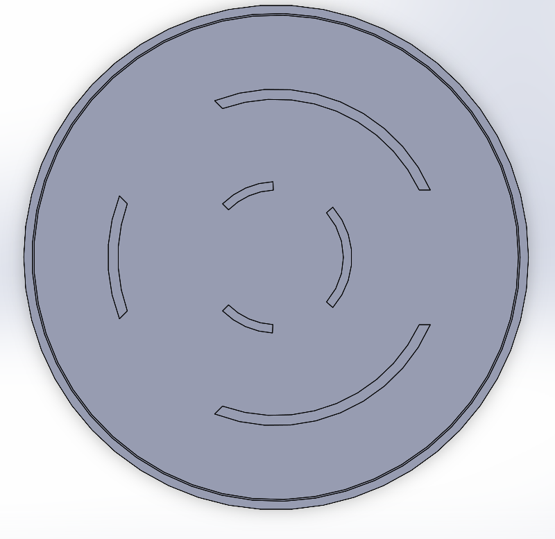
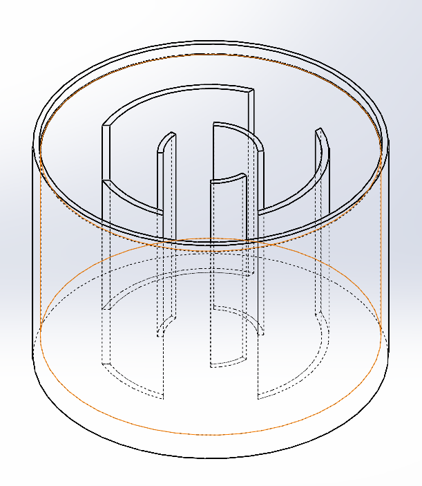
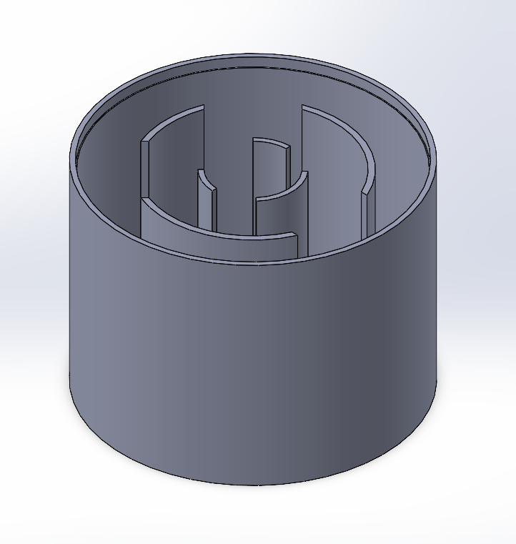
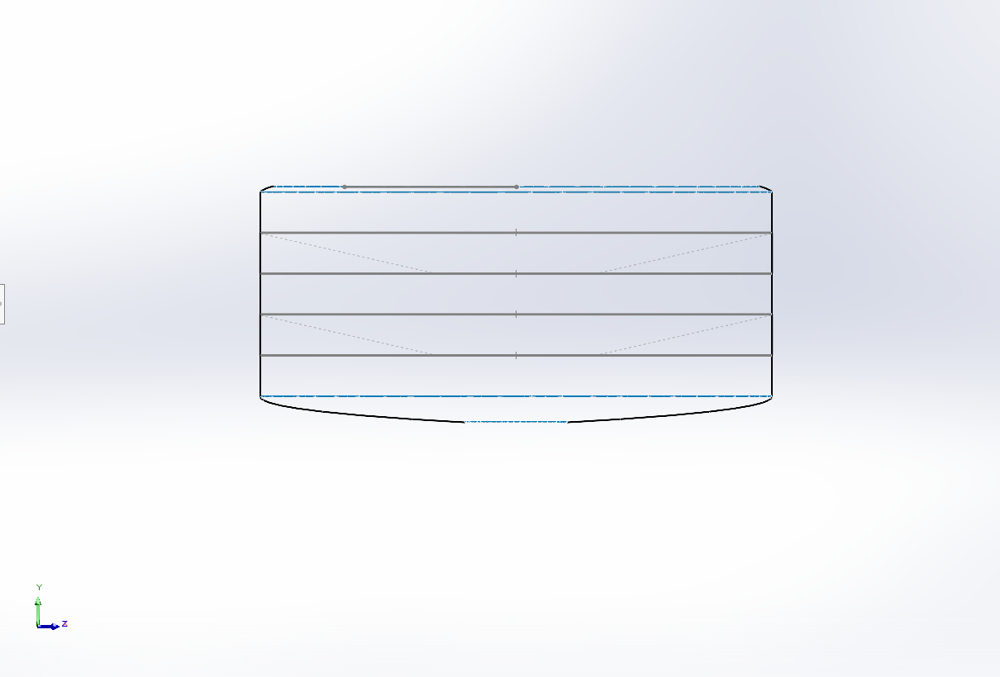
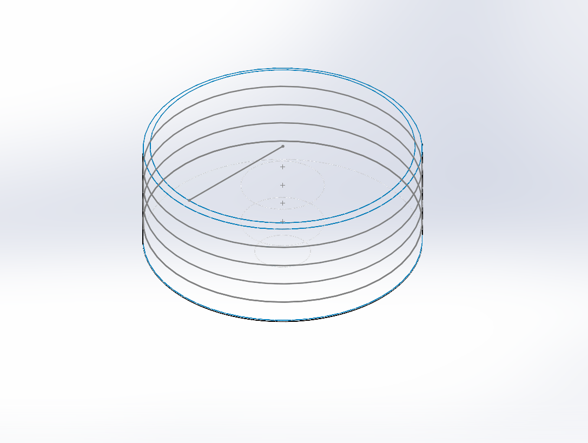
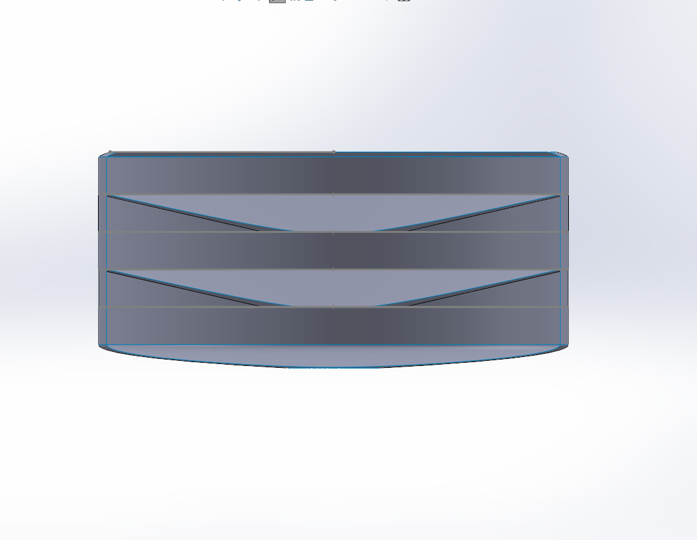
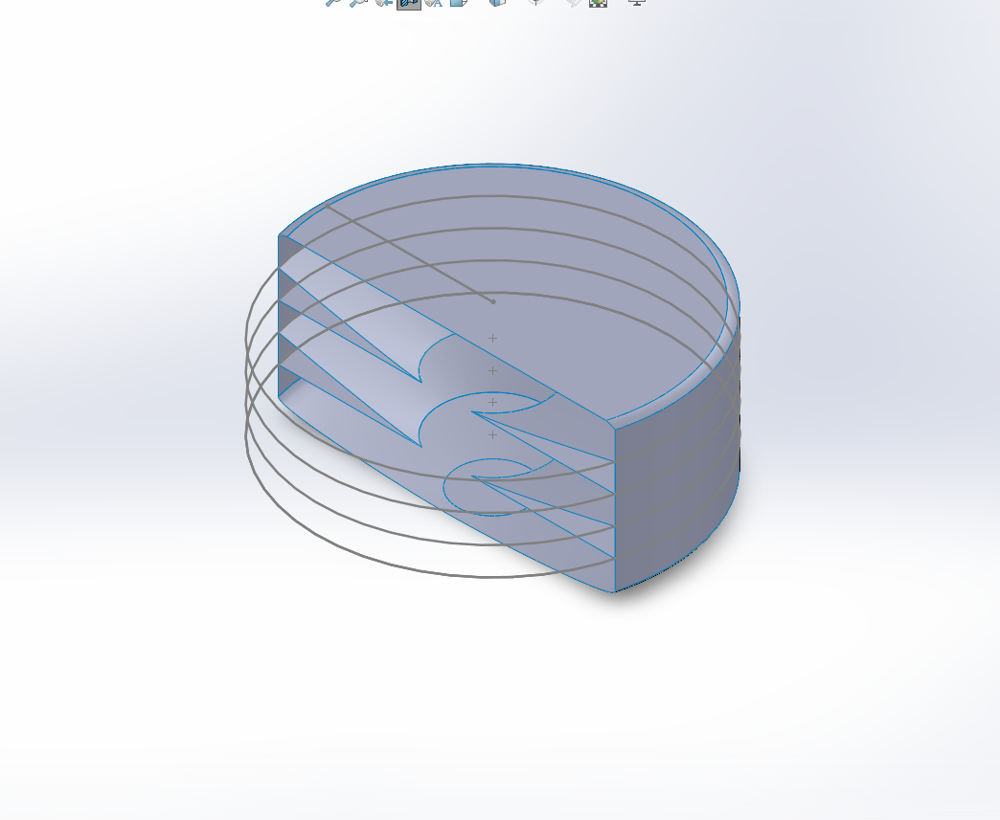

# ARRC-Drone-WaterTank

## 1.0 Introduction  
This is my contribution to UBCO's participation in the 2025 AEAC National Student UAS Competition. In essence, part 2 of the competition outlines that the team must transport water to various hotspots using a drone. To achieve this, the team has decided to use a water tank, the design of which was completed by me and a few others. I will walk you through the design process I took, as well as each iteration of the water tank's design.  

## V0  

The main thing to note with version 0 is the design of the baffles. Our primary concern was the sloshing caused by the water within the tank. Since this tank was placed a considerable distance from the center of mass of the drone, and we were considering carrying up to 4L of water, the focus was placed on designing baffles. Our goal was to minimize the headache experienced by the software team by reducing/eliminating oscillations caused by water movement within the tank.  

As you can see, I went with a **circular baffle design**, while the rest of my peers went with a simpler square grid baffle. During the meeting of the water tank team, my design was chosen because **when the drone rotates, which it does often, square baffles mean that it will have to carry the inertia of the water with it while it rotates, whereas circular/axially symmetric baffles eliminate that inertia while still segregating the water**.  

## V1  

The baffle has been completely redesigned in this version. My proposal for the new baffle design is the one currently being used on the drone. Instead of using vertical baffles to distribute the momentum of the water hitting the side of the tank, I used **horizontal baffles to eliminate any sloshing at all**.  

We have chosen to deposit 500ml of water to each hotspot, hence a horizontal baffle was placed every 500ml within the tank. The angle of the baffle is based on the maximum amount of tilt the drone will experience during flight, as this would seal off the free surface when the drone tilts. Feel free to ask me more about this during the interview! I would love to expand on this more!  

Since we still planned to carry 4L of water, we would need 8 compartments, meaning 7 horizontal baffles would be needed. As you can see, only 2 are shown in the picture. This is due to an error in volume calculation, which will be addressed in future versions.  

## V2 to V3  
Mostly changing the dimensions due to physical constraints of the drone. However, the general design for the tank and the baffles remains the same. V3 saw the volume shrink to 2.5L due to the max weight constraint of 15kg and motor/battery upgrades made on the drone.  

## V4  
A major redesign of the tank for the drone. Instead of having one large tank, we now have a primary and secondary tank. This serves two purposes.  

Firstly, as we need to deposit precisely 500ml of water at each hotspot, having a secondary tank connected to the primary tank makes manufacturing much easier. It is easier to manufacture an entire tank to 500ml than to manufacture the bottom volume (the 500ml volume created using baffles in the 2.5L tank) of a singular tank to 500ml.  

Secondly, this solves the issue of needing to embed an electronic valve inside the tank, as two valves were needed in the original design—one at the exit and one at the first baffle from the bottom up inside the tank. I would also love to clarify why we need two valves if it is not clear!  

Therefore, this is the design we decided on: a secondary tank with a volume of 500ml and a primary tank with a volume of 1.7L (1.5L + 0.5L overhead).  
